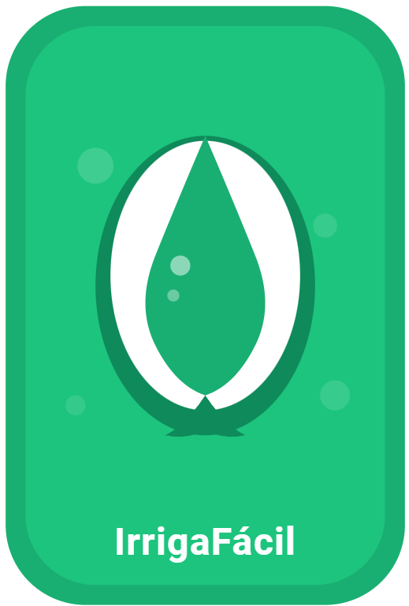

# 💧 AgroGota IrrigaTech

<p align="center">
  
</p>

<p align="center">
  
  
  
  
  
</p>

Aplicativo mobile para manejo de irrigação voltado à agricultura familiar, desenvolvido em Flutter.

## 📱 Sobre o projeto

O AgroGota IrrigaTech auxilia pequenos produtores rurais a saberem exatamente quanto tempo devem deixar a irrigação ligada a cada dia, evitando desperdício de água e energia elétrica.

O app traduz cálculos científicos complexos em uma resposta simples e direta:

> **"Ligue a irrigação por X minutos hoje."**

## 🎯 Público-alvo

- Pequenos agricultores familiares
- Assentamentos rurais
- Produtores de hortaliças e frutas
- Técnicos agrônomos e extensionistas rurais
- Cooperativas agrícolas
- Prefeituras e Secretarias de Agricultura
- Instituições de ensino agrícola (IFMS e similares)

## ⚙️ Como funciona

**Primeira vez (configuração única):**
1. Seleciona a região e município do MS — o tipo de solo é sugerido automaticamente
2. Escolhe a cultura plantada e o estágio fenológico
3. Informa a vazão do gotejador e a área por planta
4. Salva — nunca mais precisa mexer nisso

**Todo dia:**
1. Informa a temperatura máxima e mínima do dia
2. Informa a umidade relativa máxima e mínima
3. Se choveu, informa a quantidade em mm — o app desconta automaticamente
4. Clica em **Calcular tempo de irrigação**
5. Recebe o resultado em minutos, milímetros e litros por planta

## 🧠 Base científica

O cálculo utiliza o método **Penman-Monteith (FAO-56)**, padrão internacional para estimativa de evapotranspiração, combinado com:

- **ETc = ETo × Kc** — evapotranspiração da cultura
- **CC e PMP** — calculados a partir de silte + argila
- **Lâmina de irrigação** — baseada na água disponível no solo
- **Tempo de irrigação** — calculado pela vazão e espaçamento
- **Balanço hídrico** — método Thornthwaite & Matter (1955)

## 🌱 Culturas disponíveis

Alface, Tomate, Pimentão, Cenoura, Cebola, Feijão, Melancia, Melão, Milho e Pepino.

## 🗺️ Solos do Mato Grosso do Sul

Banco de dados com tipos de solo predominantes por região e município do MS, baseado no mapa oficial de solos do estado. Regiões cobertas:

- Central, Leste / Dourados, Costa Leste / Bolsão
- Nordeste, Norte, Sul / Cone Sul
- Pantanal, Sudoeste

O produtor seleciona o município e o tipo de solo é preenchido automaticamente, podendo ser ajustado manualmente se necessário.

## 💧 Balanço Hídrico

Dados climatológicos mensais de Dourados/MS — método Thornthwaite & Matter (1955). O app mostra para cada mês:

- Precipitação e evapotranspiração
- Déficit hídrico — quando irrigar mais
- Excedente hídrico — quando a chuva já resolve

## 🌧️ Campo de chuva

O produtor informa a quantidade de chuva do dia em milímetros e o app desconta automaticamente da irrigação necessária, economizando água e energia.

## 📡 Funciona 100% offline

Todos os dados necessários estão dentro do app:

- Banco de Kc por cultura e estágio fenológico
- Radiação solar média histórica mensal para o MS
- Tipos de solo por município do MS
- Dados de balanço hídrico climatológico
- Banco de dados local SQLite para histórico e configurações

## 🖥️ Telas do app

- **Onboarding** — guia de uso na primeira abertura
- **Irrigar** — entrada dos dados climáticos do dia
- **Resultado** — tempo, lâmina e volume por planta
- **Histórico** — registros anteriores com opção de exclusão
- **Balanço Hídrico** — déficit e excedente mensal
- **Configuração** — solo, cultura e sistema de irrigação

## 🛠️ Tecnologias utilizadas

- [Flutter](https://flutter.dev/) — framework multiplataforma
- [Dart](https://dart.dev/) — linguagem de programação
- [SQLite (sqflite)](https://pub.dev/packages/sqflite) — banco de dados local
- [Shared Preferences](https://pub.dev/packages/shared_preferences) — armazenamento local
- [Provider](https://pub.dev/packages/provider) — gerenciamento de estado

## 📂 Estrutura do projeto

```
lib/
├── main.dart
├── db/
│   └── database_helper.dart
├── models/
│   ├── solo.dart
│   ├── cultura.dart
│   ├── entrada_climatica.dart
│   └── resultado.dart
├── data/
│   ├── kc_data.dart
│   ├── radiacao_data.dart
│   ├── solo_data.dart
│   ├── regioes_ms_data.dart
│   └── balanco_hidrico_data.dart
├── services/
│   └── calculo_service.dart
└── screens/
    ├── onboarding_screen.dart
    ├── entrada_screen.dart
    ├── resultado_screen.dart
    ├── historico_screen.dart
    ├── balanco_screen.dart
    └── config_screen.dart
```

## 🚀 Como rodar o projeto

```bash
# Clone o repositório
git clone https://github.com/Legiano/agrogota.git

# Entre na pasta
cd agrogota

# Instale as dependências
flutter pub get

# Rode o app
flutter run
```

## 📦 Gerar APK

```bash
flutter build apk --release
```

O arquivo será gerado em:
```
build/app/outputs/flutter-apk/app-release.apk
```

## 👨‍💻 Desenvolvido por

**Legiano Lucio Rodrigues**

Projeto desenvolvido no **IFMS — Instituto Federal de Mato Grosso do Sul**

---

© 2026 AgroGota IrrigaTech — IFMS
